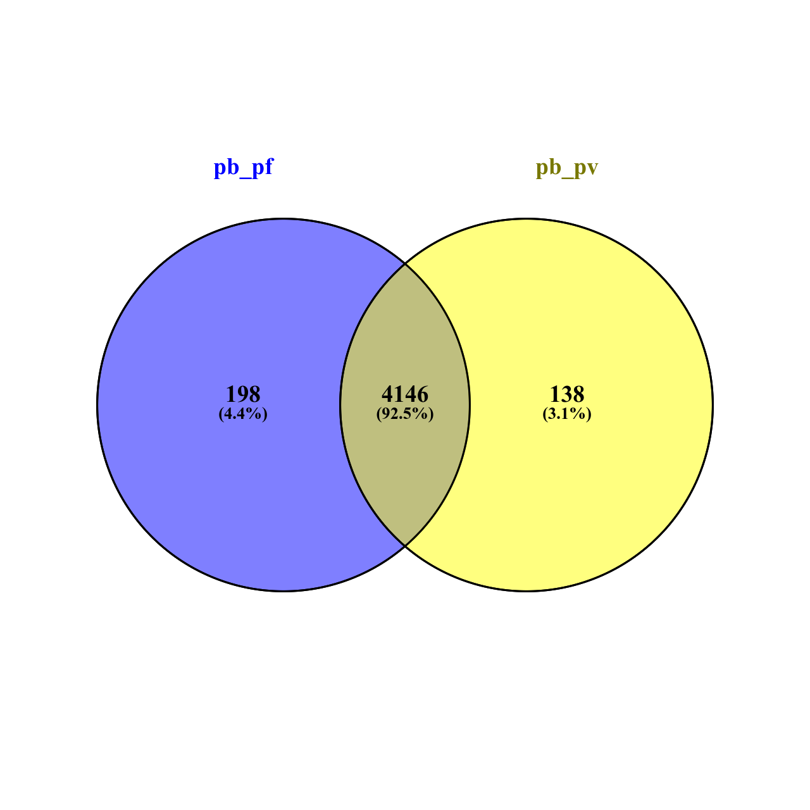
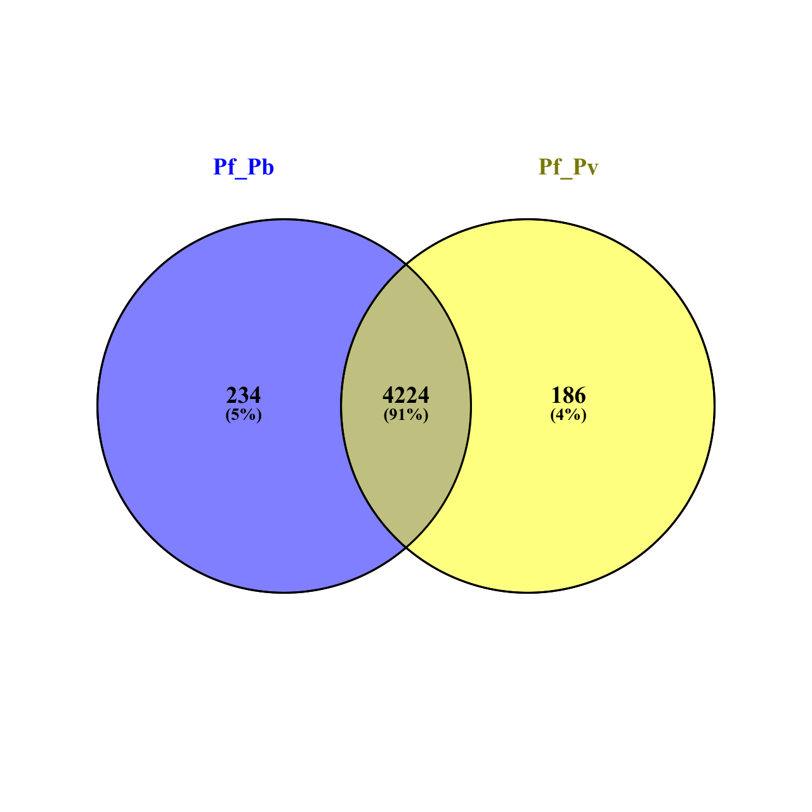
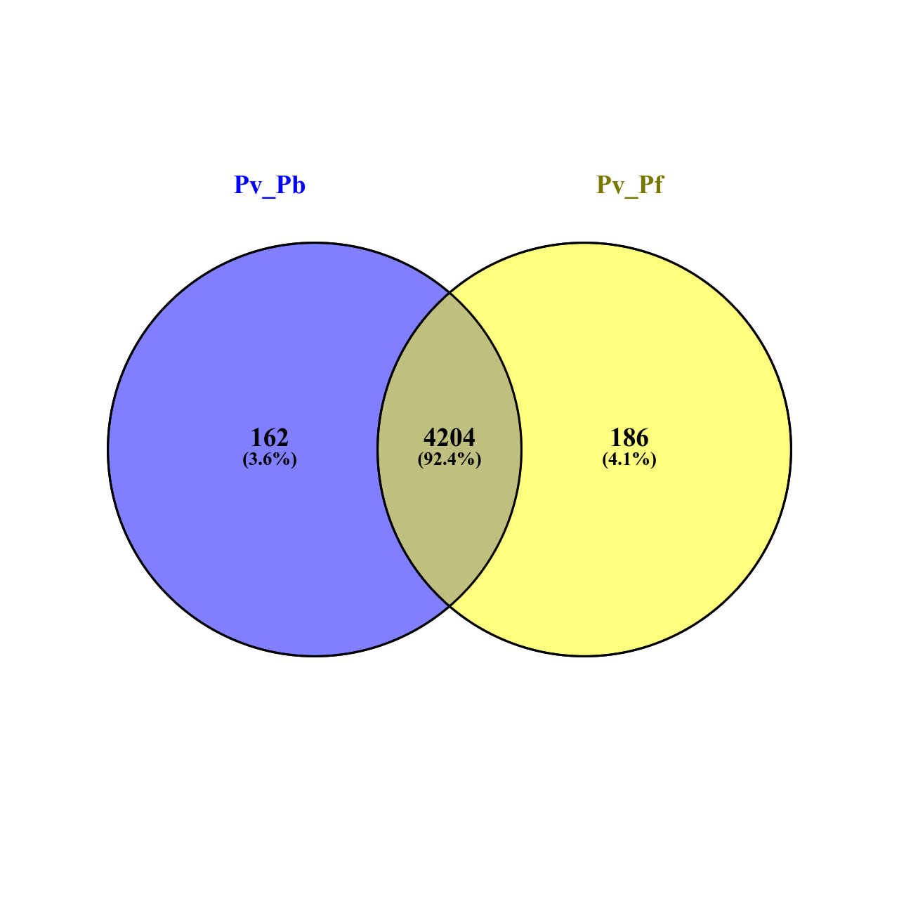

# Merge data sets
To merge all datasets for each species, we follow these steps:

1. Transform the gene IDs of *P. falciparum* and *P. vivax* into *P. berghei* gene IDs by using the BioMart tool in the Ensembl Protists genome browser (release 60).
2. Access the BioMart tool at the following URL: https://protists.ensembl.org
3. Select "Protein Coding" as the gene type.
4. Optionally, choose "Protein Coding" as the transcript type.
5. Under "MULTI SPECIES COMPARISONS," apply the homologue filters to include only orthologous genes to *P. berghei*, ensuring to select unique results only.
6. Source of the gene should be "ena."

```R
pb=c("ERP004740_PE.txt", "ERP105548_PE.txt", "SRP027529_SE.txt", "SRP073801_PE.txt", "SRP099925_PE.txt", "SRP197607_PE.txt", "SRP197607_SE.txt", "SRP250329_SE.txt")
pf=c("SRP048710_PE.txt", "SRP069075_SE.txt",  "SRP090611_SE.txt", "SRP142460_SE.txt", "SRP211863_PE.txt" )
pv=c("SRP046739_PE.txt", "SRP100893_SE.txt")

#### Clean count txt files
# cd quantification
#sed -i 's/\/cbio\/projects\/022\/adam\/project_adaobi\/datasets\/raw_data_mapped\///g' *txt*
#sed -i 's/Aligned.sortedByCoord.out.bam//g' *txt*
#sed -i '1d'  *.txt*
#sed -i 's/gene://g' *txt*


## merge per species count files
cols_remove=c(2,3,4,5,6)


# pb
pb_count=read.table(pb[1], header=T)
for( i in 2:length(pb)){
df=read.table(pb[i], header=T)
df <- df[ -c(2,3,4,5,6) ]
pb_count= merge(pb_count, df, by="Geneid")
}

dim(pb_count)

write.table(pb_count, file="pb_count.txt", row.names=F)


# pf

pf_count=read.table(pf[1], header=T)
for( i in 2:length(pf)){
df=read.table(pf[i], header=T)
df <- df[ -c(2,3,4,5,6) ]
pf_count= merge(pf_count, df, by="Geneid")
}

dim(pf_count)

write.table(pf_count, file="pf_count.txt", row.names=F)

# pv
pv_count=read.table(pv[1], header=T)
for( i in 2:length(pv)){
df=read.table(pv[i], header=T)
df <- df[ -c(2,3,4,5,6) ]
pv_count= merge(pv_count, df, by="Geneid")
}

dim(pv_count)

write.table(pv_count, file="pv_count.txt", row.names=F)

################################
################################
### Extract orthologous genes

# pb
pb_orthologous=read.table("pb_orthologous.csv", header=T)
pb_final=merge(pb_orthologous, pb_count, by="Geneid")
dim(pb_final)

write.table(pb_final, file="pb_count_orthologous.txt", row.names=F)
#Pf
pf_orthologous=read.table("pf_orthologous.csv", header=T)
pf_final=merge(pf_orthologous, pf_count, by="Geneid")
dim(pf_final)
write.table(pf_final, file="pf_count_orthologous.txt", row.names=F)
#pv
pv_orthologous=read.table("pv_orthologous.csv", header=T)
pv_final=merge(pv_orthologous, pv_count, by="Geneid")
dim(pv_final)
write.table(pv_final, file="pv_count_orthologous.txt", row.names=F)
```

## Genes annotations files:
The downloaded annotation file for each for each species has attached as follows: 

1. p breghei  --> 
   - All  genes protein coding genes -->  martquery_0116140127_444.txt.gz.
   - Pb orthologous Pf  --> martquery_0119172720_255.txt.gz
   - Pb orthologous Pv  -- > martquery_0119172647_817.txt.gz
2. P.falciparum 3D7 genes (ASM276v2):
   - Pf orthologous Pb  --> martquery_0116135016_882.txt.gz
   - Pf orthologous Pv  -- > martquery_0119171522_690.txt.gz
3. Plasmodium vivax genes (ASM241v2):
   - Pv orthologous Pb  --> martquery_0116140813_393.txt.gz
   - Pv orthologous Pf  -->  martquery_0119171142_578.txt.gz

## Final gene IDs.
- Retain genes with 1:1:1 orthologues across the three species.
Venn diagrams are generated using [Venny 2.1 By Juan Carlos Oliveros](https://bioinfogp.cnb.csic.es/tools/venny/index.html)
1. [Pb orthologous](pb_orthologous.csv)

2. [Pf orthologous](pf_orthologous.csv)

3. [Pv orthologous](pv_orthologous.csv)
